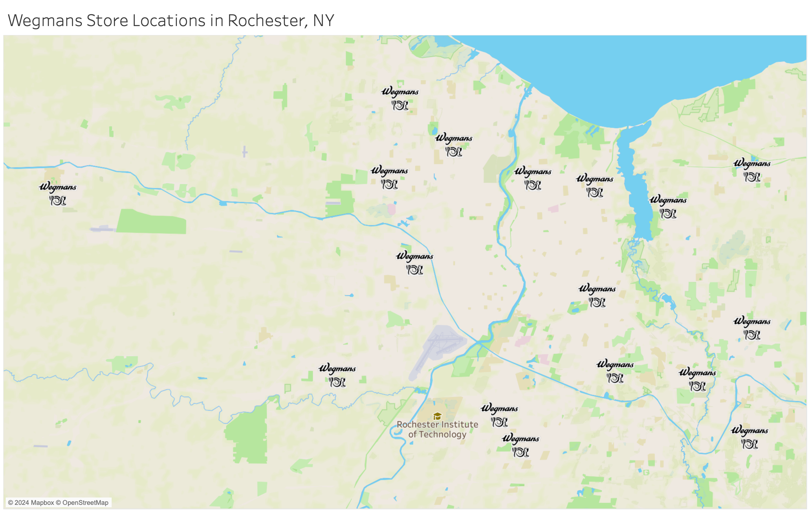

# Nandhini_Portfolio_1
Data Analyst Portfolio

# [Geospatial Visualization of Wegmans Locations | Tableau](https://public.tableau.com/app/profile/nandhini.lakshman/viz/WegmansMapRochesterNY/Sheet1)

- Created an interactive map using Tableau to help users easily locate Wegmans stores 
- Customized map pins with the Wegmans logo for enhanced location identification and brand consistency
- Enhanced user experience by implementing a hover feature to display store addresses when users hover over pins

&nbsp;&nbsp;&nbsp;

# [Computational Analysis of Gender Perception in the UK, Capstone Project](https://github.com/niranjanadeshpande/hansardscraping)

- Scraped parliamentary text transcripts from the Hansard website to analyze gender perception in the UK from 1800 – 2004 using BeautifulSoup
- Visualized the percentage of male and female pronoun usage by decade to quantify gender perception using matplotlib observing that male pronoun usage consistently exceeded female pronoun usage by a margin of 75% throughout the decades while observing a 5% rise in female pronoun usage from 1950 to 2004
- Developed wordclouds to generate insights that depicted the trends in terms associated with women from the 1800s – 2000s using fastText

&nbsp;&nbsp;&nbsp;
&nbsp;&nbsp;&nbsp;

# [Spotify Song Popularity Analysis](https://github.com/nandhinishankarl/Nandhini_Portfolio/blob/main/Spotify_Billboard_Hot_100.ipynb)

- Utilized the Spotipy library to scrape track information from Spotify for 100 songs on the Billboard Hot 100 list to gain user preference insights
- Visualized the top 10 streamed artists using matplotlib, SZA topped the list with 6 songs
- Plotted a frequency graph to visualize the distribution of songs based on their emotional characteristics that identified 56 sad songs and 44 happy songs

&nbsp;&nbsp;&nbsp;
&nbsp;&nbsp;&nbsp;

# [Sentiment Analysis of Midnights, Taylor Swift’s album](https://github.com/nandhinishankarl/Sentiment-Analysis-Projects/blob/main/Midnights%20Sentiment%20Analysis%20-3.ipynb)

- Employed the LyricsGenius library to scrape lyrics from 13 songs to analyze the overall sentiment of the Midnights album
- Utilized the re package to clean lyrics data by removing unnecessary words and characters
- Generated a bar graph of sentiment scores for all songs using matplotlib that identified 4 songs with negative scores and 9 songs with positive scores reflecting Taylor Swift’s happiness
  
&nbsp;&nbsp;&nbsp;

# [Analysis of Highest Grossing Disney Films](https://github.com/nandhinishankarl/Nandhini_Portfolio/blob/main/Disney_Movie_Analysis.ipynb)

- Utilized the BeautifulSoup library to scrape information from Wikipedia for Disney films
- Designed a bar graph of the top 10 grossing films using matplotlib that identified The Lion King as the highest grossing Disney film to date

&nbsp;&nbsp;&nbsp;
